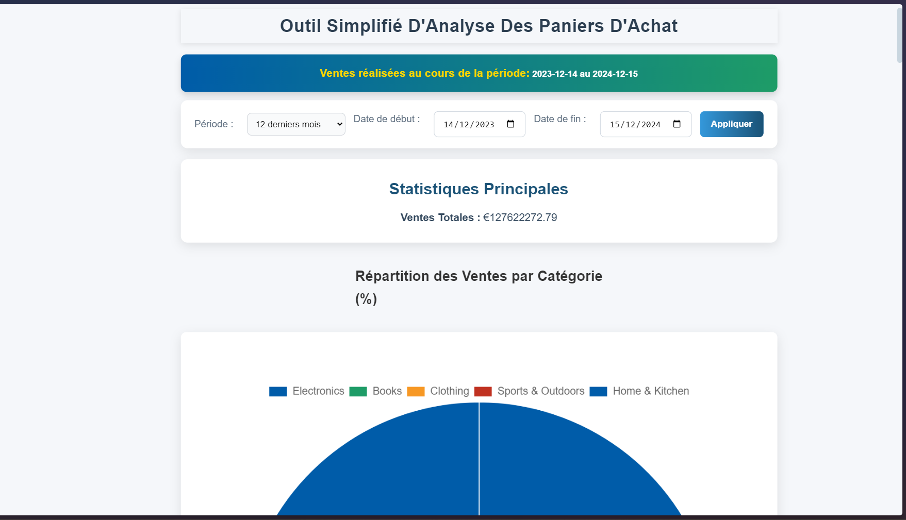

# Projet Frontend et Backend

Bienvenue dans le projet **Frontend et Backend**. Ce dépôt contient les deux principales parties de l'application :

- **Frontend** : L'interface utilisateur développée avec [votre framework frontend].
- **Backend** : L'API et la logique métier développées avec [votre framework backend].

---

## Aperçu de l'Application

Voici un aperçu de l'application :



> **Note :** Assurez-vous de placer un fichier image dans un dossier `screenshots` au même niveau que ce fichier README.

---

## Structure du Projet

Le projet est organisé comme suit :

```
├── frontend/       # Code source du 
├── backend/        # Code source du 
├── screenshots/    # Captures d'écran de l'application
└── README.md       # Fichier README principal (ce fichier)
```

Chaque partie du projet contient un fichier `README.md` spécifique avec des instructions détaillées.


### Étapes d'installation

1. Clonez ce dépôt :

   ```bash
   git clone <lien-du-dépôt>
   cd <nom-du-dossier>
   ```

2. Installez et démarrez chaque partie :

#### Frontend

```bash
cd frontend
npm install
npm start
```

#### Backend

```bash
cd backend
pip install -r requirements.txt
python main.py
```

> **Note :** Adaptez les commandes ci-dessus à votre projet si nécessaire.

---

## Contribution

Les contributions sont les bienvenues !

1. Forkez ce dépôt.
2. Créez une branche pour votre fonctionnalité ou correction de bug : `git checkout -b feature/nom-fonctionnalite`.
3. Effectuez vos modifications et testez-les.
4. Soumettez une Pull Request.

---

## Licence

Ce projet est sous licence [nom de la licence]. Veuillez consulter le fichier LICENSE pour plus de détails.
